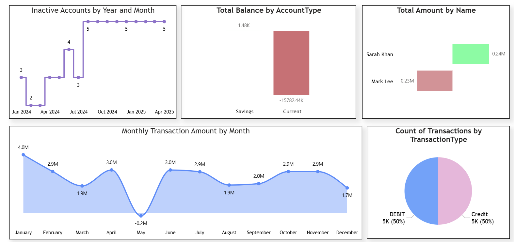
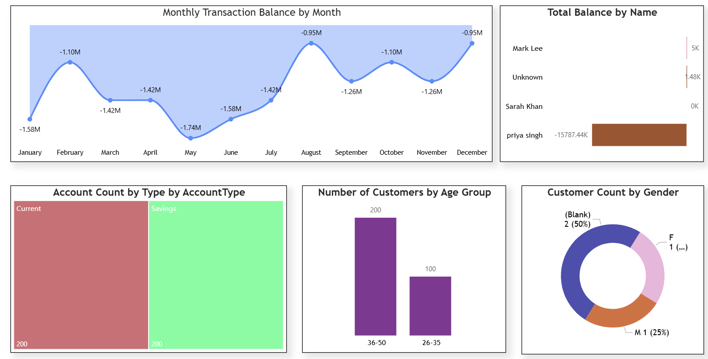

# 💼 AI-Enhanced Banking Analytics Dashboard  
*Built with SQL, Power BI & Perplexity AI*

This end-to-end project showcases how artificial intelligence, SQL, and BI tools can be combined to extract real-world banking insights. From generating synthetic data to visualizing KPIs, the project leverages **SQL for transformation**, **Power BI for storytelling**, and **Perplexity AI for DAX and design recommendations**.

---

## 🚀 Project Overview

The dashboard focuses on analyzing customer transactions, balances, and account behaviors. You’ll find key trends across months, types, and user demographics. This project simulates a modern banking analytics solution that a financial analyst or BI developer would build.

---

## 🧰 Tech Stack

- **SQL Server** – Data generation, cleaning, and joining  
- **Power BI Desktop** – Data model, DAX, KPIs, visuals  
- **Power BI Service** – Publishing and sharing dashboard  
- **Perplexity AI** – Helped with SQL queries, DAX formulas, and visual suggestions  

---

## 📊 KPIs Implemented

| KPI Name                             | Page    | Visual Type         |
|--------------------------------------|---------|----------------------|
| Transactions by Type                 | Page 1  | Pie Chart            |
| Monthly Transaction Amount           | Page 1  | Area Chart           |
| Top Customers by Transaction Value   | Page 1  | Bar Chart (Top 2)    |
| Total Balance by Account Type        | Page 1  | Bar Chart            |
| Inactive Accounts by Year and Month  | Page 1  | Line with Markers    |
| Monthly Transaction Balance          | Page 2  | Line Chart           |
| Total Balance by Customer Name       | Page 2  | Bar Chart            |
| Account Count by Account Type        | Page 2  | Treemap              |
| Customers by Age Group               | Page 2  | Bar Chart            |
| Customers by Gender                  | Page 2  | Donut Chart          |

✅ **Mapped using Excel KPIs (Page 1 & Page 2) + Dashboard Images**

---

---

## 📦 Workflow Summary

### 1. 🧱 Data Engineering
- Generated synthetic customer & transaction data using **SQL + Perplexity**
- Resolved inconsistencies in **date columns**
- Performed **SQL joins** across 3 tables

### 2. 🧼 Data Cleaning (Power BI)
- Cleaned blank/missing values
- Standardized transaction types, gender, and account types
- Created calculated columns like:
  - `Customer Age`
  - `Customer Age Group`
  - `Is Active` flag

### 3. 📈 Dashboard Design
- Used **Perplexity AI** to:
  - Recommend best-fitting chart types
  - Write DAX measures for KPIs
  - Suggest layout structure
- Focused on **business storytelling**

### 4. 📤 Deployment
- Published final `.pbix` to **Power BI Service**
- Organized dashboard across 2 pages for clarity

---

## 🔍 Key Insights

- 📉 Transaction activity dropped sharply in **May**
- ⚠️ One customer holds a large **negative balance**
- 🧓 Most customers are aged **36–50**
- 👫 Gender distribution is even, but some data is **missing**
- 💳 **Credit and Debit** transactions are perfectly balanced (50/50)

---

## 🧠 What I Learned

- Writing modular, efficient SQL queries for analytics  
- Creating dynamic DAX measures for categorization and KPIs  
- Leveraging **Perplexity AI** for boosting BI development  
- End-to-end BI flow: from raw data → cleaned → modeled → visualized  
- Publishing & structuring professional dashboards on **Power BI Service**

---

## 📂 Project Files

| File | Description |
|------|-------------|
| `POWER_BI_PROJECT_AI.pbix` | Full dashboard file |
| `Page_1.png` | Screenshot – Transactions & KPIs |
| `Page_2.png` | Screenshot – Customer & Balance Metrics |
| [`Page 1 KPI CSV`](./KPI-Description-Visual-DAXCalculatedColumnExample+Page+1.csv) | KPI & DAX breakdown – Page 1 |
| [`Page 2 KPI CSV`](./KPI-Description-Visual-DAXCalculatedColumnExample+Page+2.csv) | KPI & DAX breakdown – Page 2 |

---

## 📍Next Steps

- ➕ Add more drilldowns and interactivity  
- 🎯 Implement slicers for dynamic filtering  
- 🔐 Introduce row-level security based on user access  
- 📡 Connect dashboard to a **live SQL source**  
- 🌐 Embed dashboard in portfolio or client website  
